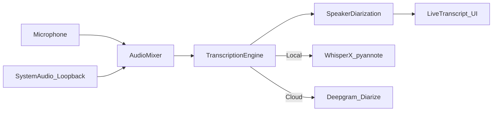

# Live Meeting Transcriber

## Product goal

A **standalone desktop application** (install once, run as its own window) that transcribes meetings **live**, regardless of source (Discord, Google Meet, Zoom, in-person, etc.), by capturing audio at the OS level — and **attributes each utterance to a distinct speaker**.

Not a web app, browser extension, Discord bot, or Meet add-on. The user opens the app beside their meeting tool; it listens to mic + system audio and shows the transcript locally.

## Standalone delivery

- **One Windows installer** (electron-builder) — double-click to install, launch from Start Menu / desktop shortcut
- **Bundled runtime** — Electron UI + Python STT sidecar + required libs shipped inside the app; user does **not** install Python, Node, or Whisper separately
- **Local models downloaded on demand** into app data (first Local session), then usable offline
- **No account required** for Local mode; Cloud mode only needs a Deepgram API key in Settings
- **Own window + optional always-on-top** so it can sit next to Discord/Meet during a call
- Sessions and exports stored on disk under the user’s app data folder

## Core insight

Do **not** build Discord/Meet-specific connectors for v1. Capture:

- **Microphone** — your voice / in-person meetings
- **System audio (loopback)** — remote participants from Discord, Meet, etc.

That single approach covers all meeting sources on the same machine. Multiple people on a call are mixed into one audio stream, so **speaker diarization** (who spoke when) is a first-class requirement, not a later nice-to-have.



## MVP scope (v1)

Included:
- Standalone installable Windows app (bundled dependencies, no separate runtimes)
- Start / stop live transcription session in its own window
- Capture mic + system audio (selectable devices)
- Live scrolling transcript with partial + final segments
- **Speaker diarization** — label utterances as Speaker 1, Speaker 2, … and allow renaming
- Engine switcher: **Local** or **Cloud** (both must return speaker IDs)
- Save session as `.txt` / `.md` / `.json` **with speaker labels**
- Basic settings: language, model size (local), API key (cloud), audio devices, max speakers hint

Deferred (v2+):
- AI meeting summary / action items
- Voice enrollment (“this is Alice”) from a short sample
- Multi-language auto-detect polish
- macOS / Linux parity
- Meeting calendar integration
- Auto-update / signed code-signing certificate polish

## Tech stack

| Layer | Choice | Why |
|-------|--------|-----|
| Shell | **Electron + React + TypeScript** | Mature desktop audio story on Windows; easy cloud WebSocket streaming |
| UI | React + Vite | Fast UI for live multi-speaker transcript |
| Local STT | **WhisperX sidecar** (faster-whisper + **pyannote.audio**) | Transcription + diarization locally |
| Cloud STT | **Deepgram Nova streaming** with `diarize=true` | Low-latency live transcription **and** speaker labels |
| Audio | Electron main process + native Windows loopback (WASAPI) | Required for Discord/Meet capture |

Repo layout (greenfield at `C:\Devop\transcriber`):

```
transcriber/
  apps/desktop/          # Electron + React
  services/stt-local/    # Python WhisperX / pyannote sidecar
  packages/shared/       # Shared types (Segment, Speaker, Session, EngineConfig)
  README.md
```

## Architecture

### Audio pipeline
1. User picks mic + output/loopback device
2. Main process captures PCM (16-bit, 16 kHz mono preferred for STT)
3. Mix mic + system into one stream for the engine (diarization needs the full conversation)
4. Chunks (~250–500 ms) sent to the active engine
5. Engine returns partial/final text events **with `speakerId`** → UI

Optional helper signal (not a substitute for diarization): if mic-only energy is high while system is quiet, bias labeling toward a “You” speaker — used as a soft prior when available, never as the only splitter.

### Engine abstraction

```ts
interface TranscriptSegment {
  id: string;
  text: string;
  speakerId: string;       // e.g. "S0", "S1"
  speakerLabel?: string;   // user rename, e.g. "Alice"
  startMs: number;
  endMs: number;
  isFinal: boolean;
}

interface TranscriptionEngine {
  start(config: EngineConfig): Promise<void>;
  sendAudio(chunk: Buffer): void;
  stop(): Promise<void>;
  on(event: 'partial' | 'final' | 'speakers' | 'error', cb: Function): void;
}
```

- `LocalWhisperEngine` — WhisperX sidecar (ASR + pyannote diarization) over local WebSocket
- `DeepgramEngine` — streaming with diarization; API key in OS-safe settings (keytar)

User can switch engine in settings before a session (v1: switch between sessions, not mid-session).

### Speaker diarization behavior

**Cloud (Deepgram)**
- Enable streaming diarization (`diarize=true`)
- Map Deepgram `speaker` integers → stable `speakerId`s for the session
- Interim results may lack stable speakers; finalize labels on final messages and backfill the UI when speaker assignment updates

**Local (WhisperX + pyannote)**
- Run rolling windows (e.g. last 10–30 s) for near-live updates, plus a full-pass refine at Stop for best speaker consistency
- pyannote needs a Hugging Face token for gated models — collect once in Settings
- Expose “expected speakers” hint (auto / 2 / 3 / 4+) to improve clustering
- Heavier on CPU/GPU than ASR alone; default local model `small` + diarization on, with a clear performance warning

**UI rules**
- Each speaker gets a stable color for the session
- Default names: Speaker 1, Speaker 2, …
- Click-to-rename updates all past + future segments for that `speakerId`
- Transcript layout: `[Speaker] text` blocks, merging consecutive same-speaker finals

### Local engine details
- Download ASR model on first use (`base`/`small` default; allow `medium`)
- Download/cache pyannote diarization pipeline on first local diarized session
- VAD to skip silence
- Prefer GPU if CUDA available; fall back to CPU
- Tradeoff in UI: smaller ASR model = faster; diarization always has a cost

### Cloud engine details
- Deepgram streaming WebSocket with interim results + diarization
- Clear error if no API key / network failure; offer fallback hint to Local
- Document that cloud diarization quality on mixed Discord/Meet audio is usually better than local on weak CPUs

## UI (v1 screens)

1. **Home / Session** — Start/Stop, live multi-speaker transcript, engine badge, elapsed time, speaker legend
2. **Devices** — mic + system audio selectors + level meters
3. **Settings** — engine, language, local model, Deepgram key, Hugging Face token (local diarization), max speakers, export defaults
4. **History** — past sessions list, open/export/delete

Visual direction: utilitarian tool UI. Transcript must make speakers scannable (color + name), not just plain paragraphs.

## Windows-first constraints

- System audio via **WASAPI loopback** (required for Meet/Discord)
- Document that some apps (exclusive-mode audio, certain headsets) may need stereo mix / virtual cable fallback
- Ship a **standalone** installer (electron-builder NSIS) for Windows x64 that embeds the STT sidecar
- First-run may download ML models; after that Local mode works offline
- Note: heavily compressed VoIP audio (Discord noise suppression, etc.) reduces diarization accuracy — document as a known limit

## Implementation phases

### Phase 1 — Skeleton
- Electron + React + Vite bootstrap
- Shared types (`TranscriptSegment`, `Speaker`, settings store)
- Empty session UI with Start/Stop

### Phase 2 — Audio capture
- Mic capture working end-to-end
- WASAPI loopback for system audio
- Device picker + level meters
- PCM chunk pipeline into main process

### Phase 3 — Local transcription + diarization
- Python sidecar with WhisperX / pyannote
- Partial/final segments with `speakerId`
- Model + HF token setup UX
- Rolling-window live updates; refine on stop

### Phase 4 — Cloud transcription + diarization
- Deepgram streaming with `diarize=true`
- API key setup + validation
- Same segment/speaker event model as local

### Phase 5 — Speaker UX + persistence + standalone package
- Speaker colors, rename, consecutive merge
- Save/export (txt/md/json) including speakers
- Session history
- Error handling, offline detection
- NSIS installer bundling Electron + sidecar; smoke-test on a clean Windows machine with no Python/Node preinstalled

## Success criteria for v1

- Install from a single `.exe` installer on a clean Windows 10/11 PC and run without installing Python, Node, or browser extensions
- In a 3-person Meet/Discord call, the live transcript shows **at least mostly distinct speakers** (Speaker 1/2/3), not one undifferentiated stream
- User can rename speakers and export a labeled transcript
- Switch between Local and Cloud and get speaker-aware output on both
- Local mode works offline after models are cached
